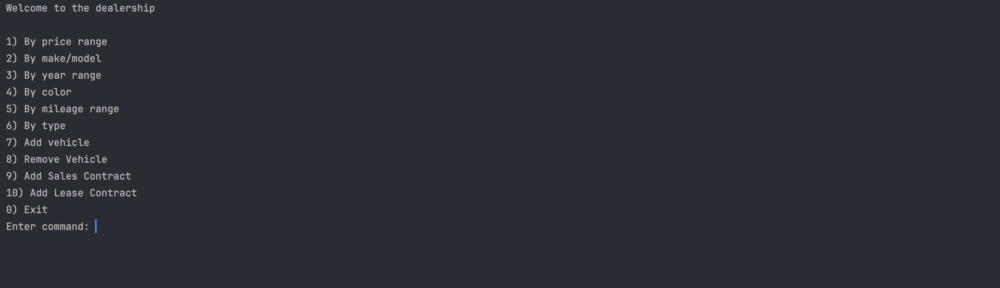

# 🚗 Car Dealership Database Console App

This is a Java-based console application that manages a car dealership's inventory, sales, and lease contracts. 
The system connects to a MySQL database and allows users to perform searches, add/remove vehicles, and record contract transactions—all via a menu-driven interface.

---

## 📌 Features

- 🔍 **Search Inventory**
    - By price range
    - By make/model
    - By year range
    - By color
    - By mileage range
    - By vehicle type

- ➕ **Add / Remove Vehicles**
    - Add a new vehicle with VIN, specs, and price
    - Remove a vehicle by VIN

- 📝 **Contract Management**
    - Add a **Sales Contract** (records VIN, customer name, date, and price)
    - Add a **Lease Contract** (records VIN, customer name, monthly payment, lease period)

- ✅ All changes are stored persistently in a **MySQL database**.

---

## 🧱 Database Schema

- `Vehicles`
- `Sales_contracts`
- `Lease_contracts`
- `Dealerships`

Refer to `schema.sql` in the `database/` folder for full table definitions.

---

## 🛠️ Technologies

- Java 17
- JDBC
- MySQL
- Apache Commons DBCP (`BasicDataSource`)
- Console I/O (Scanner)

---

---

## 🖥️ Screenshots

### 🔹 Home Menu


---

### 🔹 Search Results (e.g., by Price)


---

### 🔻 Error Example (Invalid input)


---

## ✨ Interesting Snippet

This method creates a clean, tabular display of each vehicle — making console output easier to scan and compare.

```java
@Override
public String toString() {
    return String.format(
        "%-10s %-10s %-6d %,10d mi  %-10s %-10s $%,10.2f  %-17s",
        model, make, year, odometer, vehicleType, color, price, vin
    );
}


## 🚀 How to Run

### 1. Clone the repo
```bash
git clone https://github.com/yourusername/car-dealership-db.git
cd car-dealership-db
